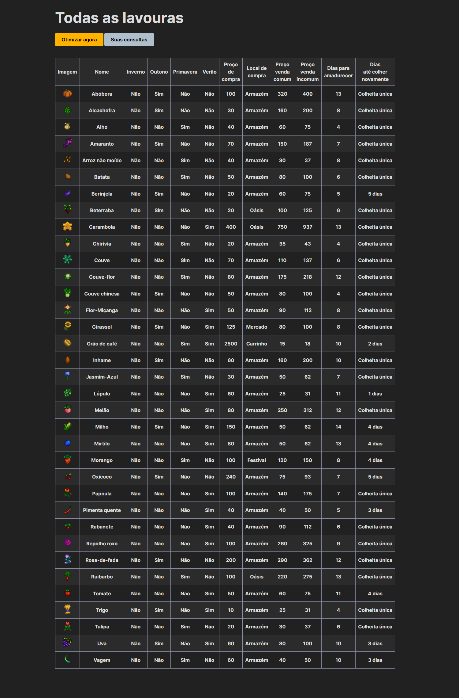
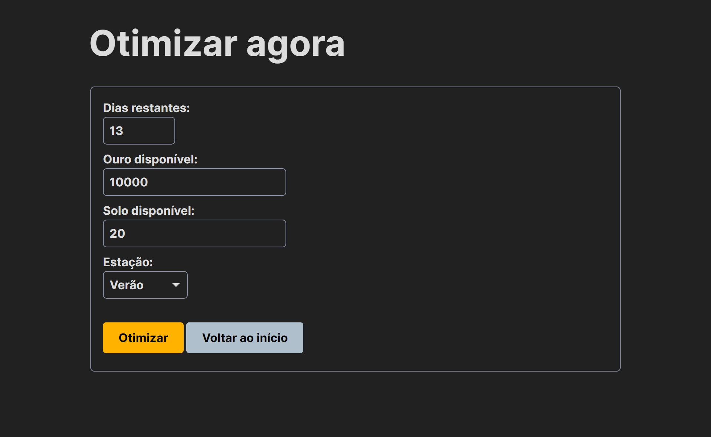
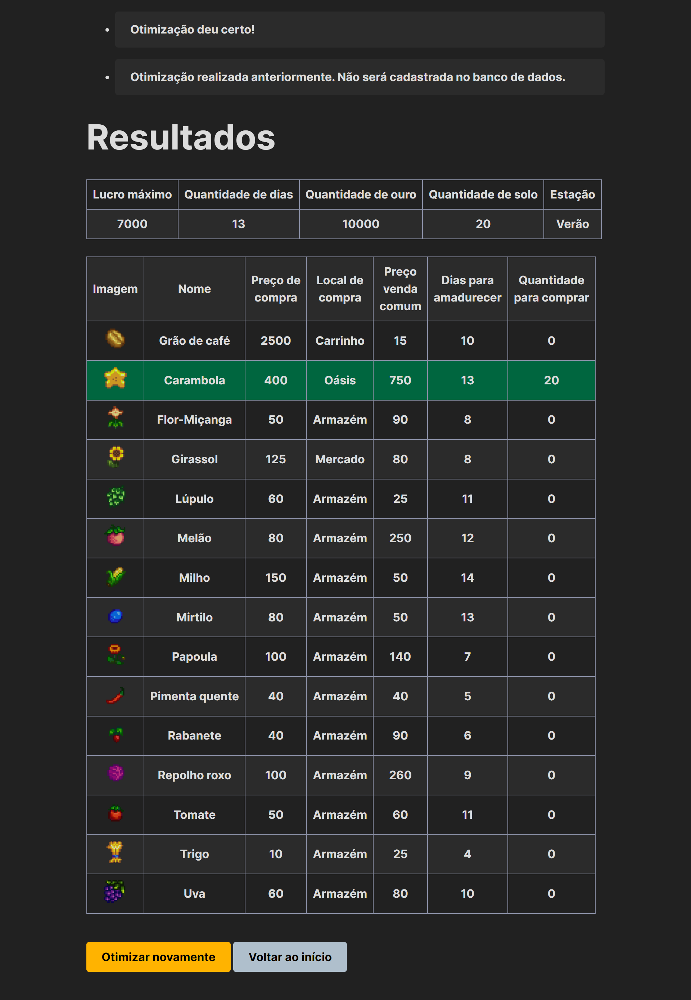
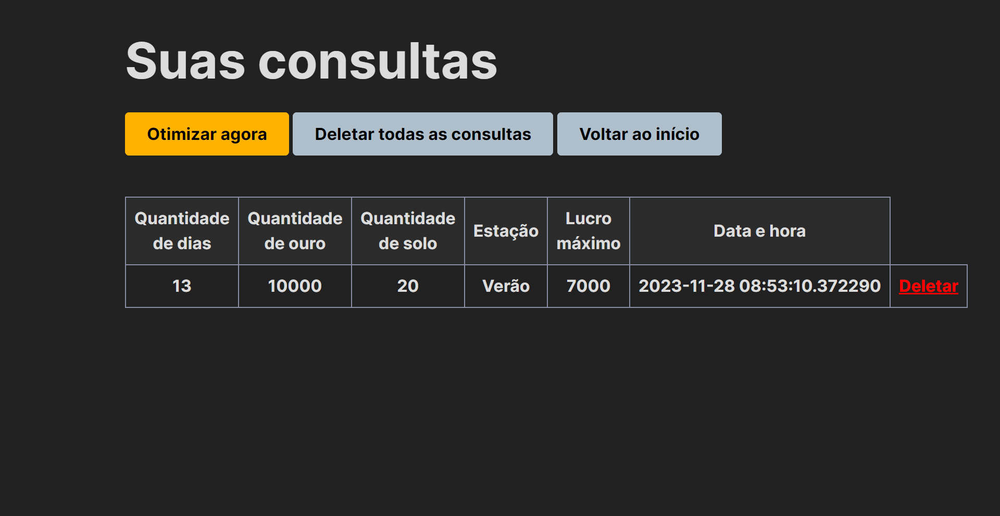

# stardew-optimizer-app
> Also check [stardew-optimizer-data](https://github.com/bruno-kalel/stardew-optimizer-data)

## Project description

Stardew Optimizer is a web app that helps you pick the best seeds in Stardew Valley. It looks at things like how many days are left in the season, how much gold you have, how much space you can plant in, and which season you're in.

## Meet the team
- [Bruno Kalel](https://github.com/bruno-kalel)
- [Rafael Maranhão](https://github.com/gabipasse)

## Table of contents
- [Technologies used](#technologies-used)
- [How to run the application](#how-to-run-the-application)
- [Usage tips](#usage-tips)
- [Project structure](#project-structure)

## Technologies used

### Web scraping tools
- **Pandas**: to manipulate and analyze data, especially in table or spreadsheet form
- **Selenium**: to automate web browsers for scraping dynamic content.
- **Beautiful soup**: to parse HTML documents for easy data extraction from web pages.
- **Unidecode**: to convert Unicode text to plain ASCII, simplifying special characters.
- **Regex**: to search, edit, or validate text through pattern matching and string manipulation.

### Web application development
- **Flask**: to build and run the web application.
- **PostgreSQL**: to manage and store the application's database.
- **Simple.css**: to style the web application easily.
- **Psycopg2**: to connect the Flask app with a PostgreSQL database, enabling interaction between them.
- **Flask SQL Alchemy**: to simplify database queries and management within Flask by using an ORM (Object-Relational Mapping) tool.
- **OR-Tools**: to solve optimization problems, like finding the best seed selection based on various factors.

## How to run the application
1. Clone the repo.
2. Set up a PostgreSQL database and run the [provided script](https://github.com/bruno-kalel/stardew-optimizer-data/blob/main/stardew-optimizer-data.sql) to create tables and add data to it.
4. Update the `config.py` file with your local PostgreSQL credentials.
5. Install the required libraries (`pip install flask flask_sqlalchemy psycopg2 ortools`).
6. Launch the app (`python stardew_optimizer.py`).

## Usage tips
- On the home page, you can check out info about the crops.
  
  

- Go ahead and fill out the form to get the best results for your case.
  
  

- Once you hit submit, you’ll see the optimized results; the rows in green show the seed(s) you need to buy.
  
  
  
- Your queries are saved, so you can revisit or delete them whenever you want.
  
  

## Project structure
- `assets/`: Contains the images used in this README.
- `static/`: Houses images, fonts, and custom CSS for the app.
- `templates/`: Has the HTML templates.
- `config.py`: The config file mentioned above.
- `stardew_optimizer.py`: The main script that handles models and routes.
